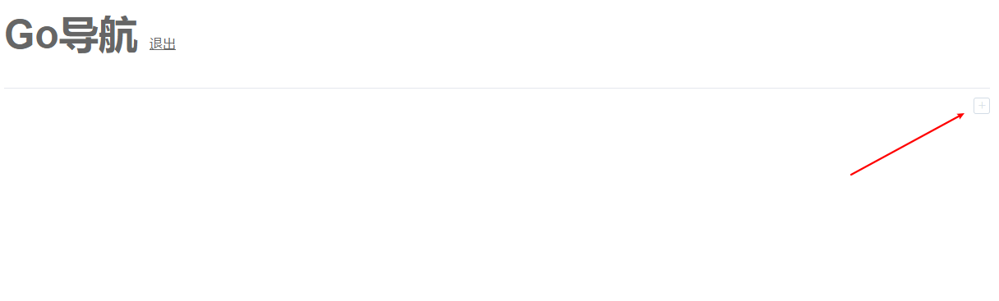

# 基于Vue+Go写的一个导航页

## 目录结构
```
--templates          --VUE打包后代码（非必须已经被打包成assets.go了）
----static
----index.html
--assets.go          --根据templates文件生成的静态文件
--main.go            --主函数
```

## 更新静态文件

```
1、替换templates的文件

2、重新打包静态文件
go-assets-builder templates -o assets.go
```

## 运行
```
# 默认配置
go run assets.go main.go

# 指定标题
go run assets.go main.go -t "哈哈"

# 指定标题&密码&端口
go run assets.go main.go -t "哈哈" -pwd "123456" -p 8081

# 帮助
go run assets.go main.go -h
```

## 打包
```
# 打包Windows(含压缩)
SET GOOS=windows
SET GOARCH=amd64
go build -o Guide.exe -ldflags "-s -w" assets.go main.go

# 打包Linux版本(含压缩)
SET GOOS=linux
SET GOARCH=amd64
go build -o Guide -ldflags "-s -w" assets.go main.go


# 压缩,其中  -ldflags 里的  -s 去掉符号信息， -w 去掉DWARF调试信息，得到的程序就不能用gdb调试了
go build -o Guide.exe -ldflags "-s -w" assets.go main.go

# upx压缩 
upx -9 Guide.exe
```

## 演示

### 效果预览


### 首页


### 登录


### 添加导航栏



### 添加导航项


### 各种操作


## 静态文件转go参考
```
https://github.com/gin-gonic/examples/tree/master/assets-in-binary
```
